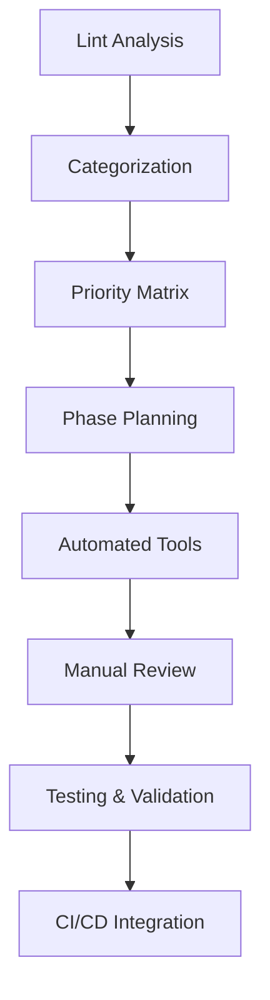
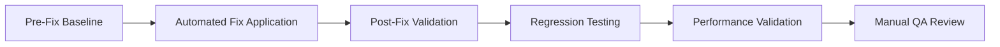

# Code Quality and Lint Cleanup Design

## Overview

This design outlines a systematic approach to resolve over 1000 ESLint warnings across the AssetTracker Pro codebase. The solution is structured in phases to minimize risk, ensure thorough testing, and maintain code functionality throughout the cleanup process.

## Architecture

### Cleanup Strategy Architecture



### File Organization Strategy

The cleanup will follow a structured approach based on file types and impact levels:

1. **Low Risk Files**: Utility functions, type definitions, constants
2. **Medium Risk Files**: Components without complex state, API routes
3. **High Risk Files**: Core business logic, authentication, database operations

## Components and Interfaces

### 1. Lint Analysis Engine

**Purpose**: Categorize and prioritize lint warnings for systematic resolution

**Interface**:
```typescript
interface LintAnalysis {
  totalWarnings: number;
  categorizedWarnings: {
    typeScript: LintWarning[];
    unusedCode: LintWarning[];
    reactHooks: LintWarning[];
    nextjsBestPractices: LintWarning[];
    htmlEntities: LintWarning[];
    accessibility: LintWarning[];
  };
  riskAssessment: RiskLevel;
}

interface LintWarning {
  file: string;
  line: number;
  rule: string;
  message: string;
  severity: 'error' | 'warning';
  category: LintCategory;
  estimatedFixTime: number;
  riskLevel: 'low' | 'medium' | 'high';
}
```

### 2. Automated Fix Tools

**Purpose**: Apply safe, automated fixes for common patterns

**Components**:
- TypeScript type generator for `any` replacements
- Unused import/variable remover
- HTML entity encoder
- Next.js Link converter

### 3. Manual Review System

**Purpose**: Handle complex fixes requiring human judgment

**Interface**:
```typescript
interface ManualReviewItem {
  warning: LintWarning;
  suggestedFix: string;
  alternativeFixes: string[];
  testingRequirements: string[];
  reviewStatus: 'pending' | 'approved' | 'rejected';
}
```

### 4. Testing Integration

**Purpose**: Ensure no functionality is broken during cleanup

**Components**:
- Pre-fix test runner
- Post-fix validation
- Regression test suite
- Performance benchmark comparison

## Data Models

### Lint Warning Categories

```typescript
enum LintCategory {
  TYPESCRIPT_ANY = 'typescript-any',
  UNUSED_IMPORTS = 'unused-imports',
  UNUSED_VARIABLES = 'unused-variables',
  REACT_HOOKS_DEPS = 'react-hooks-deps',
  NEXTJS_LINKS = 'nextjs-links',
  HTML_ENTITIES = 'html-entities',
  EMPTY_INTERFACES = 'empty-interfaces',
  ERROR_HANDLING = 'error-handling'
}

enum RiskLevel {
  LOW = 'low',      // Safe automated fixes
  MEDIUM = 'medium', // Requires review but low impact
  HIGH = 'high'     // Critical business logic, needs careful review
}
```

### Fix Strategy Model

```typescript
interface FixStrategy {
  category: LintCategory;
  automationLevel: 'full' | 'partial' | 'manual';
  batchSize: number;
  testingRequired: boolean;
  rollbackPlan: string;
}
```

## Error Handling

### Rollback Strategy

1. **Git Branch Strategy**: Each phase gets its own feature branch
2. **Incremental Commits**: Small, focused commits for easy rollback
3. **Automated Testing**: Full test suite runs before each merge
4. **Backup Points**: Tagged releases before major cleanup phases

### Error Detection

```typescript
interface ErrorDetection {
  preFixTests: TestResult[];
  postFixTests: TestResult[];
  performanceMetrics: PerformanceComparison;
  buildStatus: BuildResult;
  lintStatus: LintResult;
}
```

## Testing Strategy

### Test Categories

1. **Unit Tests**: Verify individual function behavior unchanged
2. **Integration Tests**: Ensure component interactions work correctly
3. **E2E Tests**: Validate critical user workflows
4. **Performance Tests**: Confirm no performance regressions
5. **Build Tests**: Verify successful compilation and bundling

### Testing Phases



### Test Automation

```typescript
interface TestAutomation {
  runPreFixTests(): Promise<TestResult[]>;
  applyFixes(fixes: Fix[]): Promise<FixResult[]>;
  runPostFixTests(): Promise<TestResult[]>;
  compareResults(pre: TestResult[], post: TestResult[]): ComparisonResult;
  generateReport(): TestReport;
}
```

## Implementation Phases

### Phase 1: Foundation and Tooling (Low Risk)
- Set up automated analysis tools
- Create fix templates and scripts
- Establish testing baseline
- Fix type definitions and interfaces

### Phase 2: Unused Code Cleanup (Low-Medium Risk)
- Remove unused imports
- Clean up unused variables
- Remove dead code
- Optimize bundle size

### Phase 3: TypeScript Type Safety (Medium Risk)
- Replace `any` types with specific types
- Add missing type annotations
- Create proper interface definitions
- Fix generic type constraints

### Phase 4: React Hooks and Components (Medium-High Risk)
- Fix useEffect dependencies
- Resolve useCallback/useMemo issues
- Update component prop types
- Fix React best practices violations

### Phase 5: Next.js and Performance (High Risk)
- Convert anchor tags to Next.js Links
- Optimize image usage
- Fix API route patterns
- Implement performance improvements

### Phase 6: Final Validation and CI Integration
- Complete test suite validation
- Performance benchmarking
- CI/CD pipeline integration
- Documentation updates

## Performance Considerations

### Bundle Size Impact
- Track bundle size changes throughout cleanup
- Ensure tree-shaking improvements are realized
- Monitor chunk splitting effectiveness

### Build Time Optimization
- Measure TypeScript compilation improvements
- Track ESLint execution time reductions
- Monitor CI/CD pipeline performance

### Runtime Performance
- Validate no performance regressions
- Measure React rendering improvements
- Check memory usage patterns

## Security Considerations

### Code Review Process
- All high-risk changes require peer review
- Security-sensitive files get additional scrutiny
- Authentication and authorization code requires security team review

### Dependency Updates
- Review any dependency changes for security implications
- Update vulnerable packages discovered during cleanup
- Maintain security scanning integration

## Monitoring and Metrics

### Success Metrics
- Lint warning count reduction (target: 0 warnings)
- Build time improvement
- Bundle size optimization
- Developer experience improvements
- CI/CD pipeline reliability

### Quality Gates
- Zero ESLint warnings before merge
- All tests passing
- No performance regressions
- Successful production deployment
- Post-deployment monitoring confirms stability