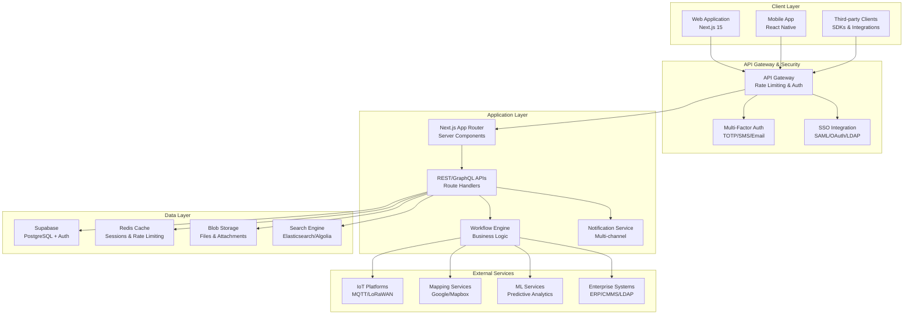
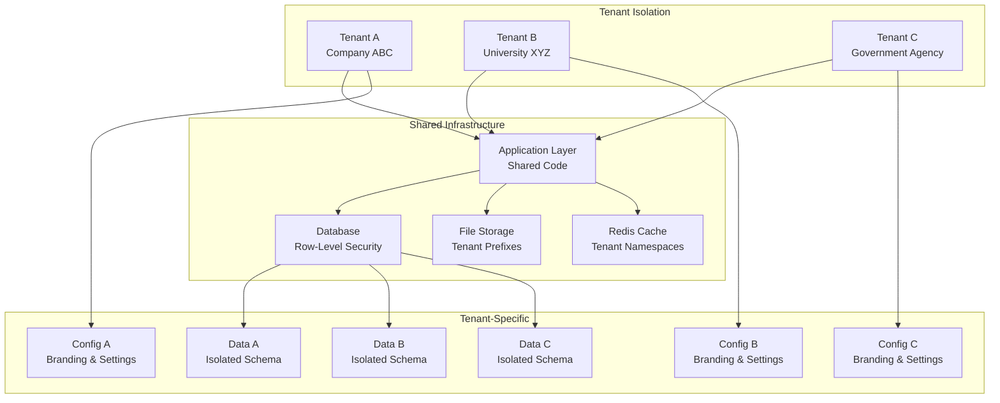
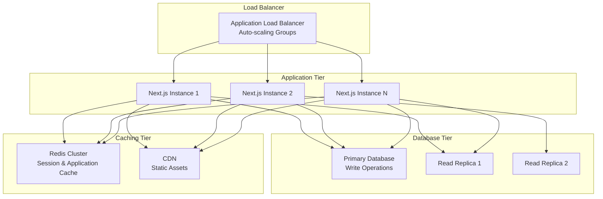

# Enterprise Asset Management Platform - Design Document

## Overview

This design document outlines the transformation of AssetTracker Pro from a functional prototype into a comprehensive, enterprise-ready asset management platform capable of competing with established solutions like AssetTrackPro.com. The design addresses critical gaps in security, scalability, compliance, and enterprise features while building upon the existing Next.js/Supabase foundation.

The platform will serve as a multi-tenant SaaS solution supporting businesses, universities, government agencies, and NGOs with professional-grade asset tracking, lifecycle management, and operational intelligence capabilities.

## Architecture

### High-Level Architecture



### Multi-Tenant Architecture



## Components and Interfaces

### Core Components

#### 1. Authentication & Authorization Service

**Purpose**: Comprehensive security layer with MFA, SSO, and RBAC

**Key Features**:
- Multi-factor authentication (TOTP, SMS, Email)
- SSO integration (SAML 2.0, OAuth 2.0, LDAP/AD)
- Hierarchical role-based access control
- Session management with concurrent session limits
- API key management with granular permissions

**Interfaces**:
```typescript
interface AuthService {
  // MFA Operations
  enableMFA(userId: string, method: MFAMethod): Promise<MFASetupResult>
  verifyMFA(userId: string, token: string): Promise<boolean>
  
  // SSO Operations
  initiateSSOLogin(tenantId: string, provider: SSOProvider): Promise<SSORedirect>
  handleSSOCallback(code: string, state: string): Promise<AuthResult>
  
  // Session Management
  createSession(userId: string, metadata: SessionMetadata): Promise<Session>
  validateSession(sessionId: string): Promise<SessionValidation>
  terminateSession(sessionId: string): Promise<void>
  
  // API Key Management
  createAPIKey(userId: string, permissions: Permission[]): Promise<APIKey>
  validateAPIKey(key: string): Promise<APIKeyValidation>
}
```

#### 2. Multi-Tenant Management Service

**Purpose**: Tenant isolation, configuration, and billing management

**Key Features**:
- Complete data isolation with RLS
- Tenant-specific branding and configuration
- Usage tracking and billing integration
- Geographic data residency compliance
- Tenant provisioning and deprovisioning

**Interfaces**:
```typescript
interface TenantService {
  // Tenant Management
  createTenant(config: TenantConfig): Promise<Tenant>
  updateTenant(tenantId: string, updates: Partial<TenantConfig>): Promise<Tenant>
  suspendTenant(tenantId: string, reason: string): Promise<void>
  
  // Configuration Management
  getTenantConfig(tenantId: string): Promise<TenantConfig>
  updateTenantConfig(tenantId: string, config: Partial<TenantConfig>): Promise<void>
  
  // Usage Tracking
  trackUsage(tenantId: string, metric: UsageMetric, value: number): Promise<void>
  getUsageReport(tenantId: string, period: DateRange): Promise<UsageReport>
}
```

#### 3. Advanced Asset Management Engine

**Purpose**: Comprehensive asset lifecycle management with predictive capabilities

**Key Features**:
- Complete lifecycle tracking (procurement to disposal)
- Predictive maintenance with ML integration
- Advanced search and filtering with Elasticsearch
- Bulk operations with conflict resolution
- Asset relationships and dependency mapping

**Interfaces**:
```typescript
interface AssetManagementEngine {
  // Asset Operations
  createAsset(tenantId: string, asset: AssetCreateRequest): Promise<Asset>
  updateAsset(assetId: string, updates: AssetUpdateRequest): Promise<Asset>
  transferAsset(assetId: string, transfer: AssetTransfer): Promise<TransferResult>
  
  // Lifecycle Management
  scheduleMaintenancePredictive(assetId: string): Promise<MaintenanceSchedule>
  processDisposal(assetId: string, disposal: DisposalRequest): Promise<DisposalCertificate>
  
  // Search and Analytics
  searchAssets(tenantId: string, query: SearchQuery): Promise<SearchResult<Asset>>
  getAssetAnalytics(tenantId: string, filters: AnalyticsFilters): Promise<AssetAnalytics>
}
```

#### 4. Workflow Automation Engine

**Purpose**: Configurable business process automation

**Key Features**:
- Visual workflow designer with conditional logic
- Multi-level approval processes with delegation
- Integration triggers for external systems
- Exception handling with manual intervention
- Performance metrics and optimization

**Interfaces**:
```typescript
interface WorkflowEngine {
  // Workflow Management
  createWorkflow(tenantId: string, definition: WorkflowDefinition): Promise<Workflow>
  executeWorkflow(workflowId: string, context: WorkflowContext): Promise<WorkflowExecution>
  
  // Process Management
  getActiveProcesses(tenantId: string): Promise<ProcessInstance[]>
  handleException(processId: string, action: ExceptionAction): Promise<void>
  
  // Performance Analytics
  getWorkflowMetrics(workflowId: string, period: DateRange): Promise<WorkflowMetrics>
}
```

#### 5. IoT & Geospatial Integration Service

**Purpose**: Real-time asset tracking and sensor data integration

**Key Features**:
- Multi-protocol IoT integration (MQTT, LoRaWAN, Sigfox)
- Advanced geospatial analysis with mapping
- Real-time GPS tracking with historical playback
- Dynamic geofencing with time-based rules
- Environmental monitoring and alerting

**Interfaces**:
```typescript
interface IoTGeospatialService {
  // IoT Integration
  registerDevice(tenantId: string, device: IoTDevice): Promise<DeviceRegistration>
  processDeviceData(deviceId: string, data: SensorData): Promise<void>
  
  // Geospatial Operations
  createGeofence(tenantId: string, geofence: GeofenceDefinition): Promise<Geofence>
  checkGeofenceViolations(assetId: string, location: GeoLocation): Promise<GeofenceEvent[]>
  
  // Tracking and Analytics
  getLocationHistory(assetId: string, period: DateRange): Promise<LocationHistory>
  generateHeatMap(tenantId: string, filters: HeatMapFilters): Promise<HeatMapData>
}
```

#### 6. Advanced Analytics & BI Engine

**Purpose**: Comprehensive reporting and predictive analytics

**Key Features**:
- Real-time dashboards with customizable KPIs
- Machine learning models for predictive insights
- Drag-and-drop report builder
- Executive reporting with automated delivery
- Cost analysis and ROI calculations

**Interfaces**:
```typescript
interface AnalyticsEngine {
  // Dashboard Management
  createDashboard(tenantId: string, config: DashboardConfig): Promise<Dashboard>
  updateDashboard(dashboardId: string, updates: DashboardUpdate): Promise<Dashboard>
  
  // Report Generation
  generateReport(tenantId: string, template: ReportTemplate): Promise<Report>
  scheduleReport(reportId: string, schedule: ReportSchedule): Promise<ScheduledReport>
  
  // Predictive Analytics
  trainPredictiveModel(tenantId: string, modelType: ModelType, data: TrainingData): Promise<Model>
  getPredictions(modelId: string, input: PredictionInput): Promise<PredictionResult>
}
```

### Integration Interfaces

#### Enterprise System Integration

```typescript
interface EnterpriseIntegration {
  // ERP Integration
  syncWithERP(tenantId: string, erpConfig: ERPConfig): Promise<SyncResult>
  
  // CMMS Integration
  createWorkOrder(assetId: string, workOrder: WorkOrderRequest): Promise<WorkOrder>
  
  // LDAP/Active Directory
  syncUsers(tenantId: string, ldapConfig: LDAPConfig): Promise<UserSyncResult>
  
  // Webhook Management
  registerWebhook(tenantId: string, webhook: WebhookConfig): Promise<Webhook>
  deliverWebhook(webhookId: string, payload: WebhookPayload): Promise<DeliveryResult>
}
```

## Data Models

### Core Entities

#### Enhanced Tenant Model
```sql
CREATE TABLE tenants (
  id UUID PRIMARY KEY DEFAULT gen_random_uuid(),
  name TEXT NOT NULL,
  slug TEXT UNIQUE NOT NULL,
  status tenant_status DEFAULT 'active',
  plan subscription_plan DEFAULT 'starter',
  settings JSONB DEFAULT '{}',
  branding JSONB DEFAULT '{}',
  data_residency TEXT DEFAULT 'us-east-1',
  created_at TIMESTAMPTZ DEFAULT NOW(),
  updated_at TIMESTAMPTZ DEFAULT NOW()
);
```

#### Advanced Asset Model
```sql
CREATE TABLE assets (
  id UUID PRIMARY KEY DEFAULT gen_random_uuid(),
  tenant_id UUID REFERENCES tenants(id) ON DELETE CASCADE,
  asset_id TEXT NOT NULL,
  name TEXT NOT NULL,
  description TEXT,
  category_id UUID REFERENCES asset_categories(id),
  status asset_status DEFAULT 'active',
  location JSONB, -- Structured location data
  assignee_id UUID REFERENCES profiles(id),
  parent_asset_id UUID REFERENCES assets(id), -- Asset hierarchy
  
  -- Financial Information
  purchase_price DECIMAL(15,2),
  current_value DECIMAL(15,2),
  depreciation_method depreciation_type DEFAULT 'straight_line',
  depreciation_rate DECIMAL(5,2),
  
  -- Lifecycle Information
  purchase_date DATE,
  warranty_expiry DATE,
  last_maintenance_date DATE,
  next_maintenance_date DATE,
  retirement_date DATE,
  
  -- Technical Information
  specifications JSONB DEFAULT '{}',
  custom_fields JSONB DEFAULT '{}',
  
  -- Tracking Information
  qr_code TEXT UNIQUE,
  rfid_tag TEXT,
  barcode TEXT,
  
  -- Audit Information
  created_by UUID REFERENCES profiles(id) NOT NULL,
  created_at TIMESTAMPTZ DEFAULT NOW(),
  updated_at TIMESTAMPTZ DEFAULT NOW(),
  
  UNIQUE(tenant_id, asset_id)
);
```

#### IoT Device Integration
```sql
CREATE TABLE iot_devices (
  id UUID PRIMARY KEY DEFAULT gen_random_uuid(),
  tenant_id UUID REFERENCES tenants(id) ON DELETE CASCADE,
  asset_id UUID REFERENCES assets(id) ON DELETE CASCADE,
  device_id TEXT NOT NULL,
  device_type iot_device_type NOT NULL,
  protocol iot_protocol NOT NULL,
  configuration JSONB DEFAULT '{}',
  last_seen TIMESTAMPTZ,
  status device_status DEFAULT 'active',
  created_at TIMESTAMPTZ DEFAULT NOW(),
  
  UNIQUE(tenant_id, device_id)
);

CREATE TABLE sensor_data (
  id UUID PRIMARY KEY DEFAULT gen_random_uuid(),
  device_id UUID REFERENCES iot_devices(id) ON DELETE CASCADE,
  sensor_type TEXT NOT NULL,
  value DECIMAL(10,4),
  unit TEXT,
  timestamp TIMESTAMPTZ DEFAULT NOW(),
  metadata JSONB DEFAULT '{}'
);
```

#### Advanced Geofencing
```sql
CREATE TABLE geofences (
  id UUID PRIMARY KEY DEFAULT gen_random_uuid(),
  tenant_id UUID REFERENCES tenants(id) ON DELETE CASCADE,
  name TEXT NOT NULL,
  description TEXT,
  geometry GEOMETRY(POLYGON, 4326) NOT NULL,
  rules JSONB DEFAULT '{}', -- Time-based rules, exceptions
  status geofence_status DEFAULT 'active',
  created_at TIMESTAMPTZ DEFAULT NOW(),
  updated_at TIMESTAMPTZ DEFAULT NOW()
);

CREATE TABLE geofence_events (
  id UUID PRIMARY KEY DEFAULT gen_random_uuid(),
  tenant_id UUID REFERENCES tenants(id) ON DELETE CASCADE,
  asset_id UUID REFERENCES assets(id) ON DELETE CASCADE,
  geofence_id UUID REFERENCES geofences(id) ON DELETE CASCADE,
  event_type geofence_event_type NOT NULL,
  location GEOMETRY(POINT, 4326),
  timestamp TIMESTAMPTZ DEFAULT NOW(),
  metadata JSONB DEFAULT '{}'
);
```

## Error Handling

### Comprehensive Error Management Strategy

#### Error Classification
```typescript
enum ErrorCategory {
  AUTHENTICATION = 'authentication',
  AUTHORIZATION = 'authorization',
  VALIDATION = 'validation',
  BUSINESS_LOGIC = 'business_logic',
  EXTERNAL_SERVICE = 'external_service',
  SYSTEM = 'system'
}

interface ApplicationError {
  code: string
  category: ErrorCategory
  message: string
  details?: Record<string, any>
  timestamp: Date
  tenantId?: string
  userId?: string
  correlationId: string
}
```

#### Error Handling Patterns
1. **Circuit Breaker Pattern**: For external service integrations
2. **Retry with Exponential Backoff**: For transient failures
3. **Graceful Degradation**: Fallback mechanisms for non-critical features
4. **Error Boundaries**: React error boundaries for UI error containment
5. **Structured Logging**: Comprehensive error logging with correlation IDs

#### Error Recovery Mechanisms
- Automatic retry for transient failures
- Manual retry options for user-initiated actions
- Fallback to cached data when external services are unavailable
- Offline mode for mobile applications with sync when connectivity returns

## Testing Strategy

### Multi-Layer Testing Approach

#### 1. Unit Testing
- **Framework**: Jest with React Testing Library
- **Coverage Target**: 90% code coverage
- **Focus Areas**: Business logic, utility functions, data transformations

#### 2. Integration Testing
- **Framework**: Playwright for E2E testing
- **Database Testing**: Test database with realistic data sets
- **API Testing**: Comprehensive API endpoint testing with various scenarios

#### 3. Performance Testing
- **Load Testing**: Artillery.js for API load testing
- **Database Performance**: Query optimization and index effectiveness
- **Frontend Performance**: Lighthouse CI for performance monitoring

#### 4. Security Testing
- **Authentication Testing**: Multi-factor authentication flows
- **Authorization Testing**: RBAC permission enforcement
- **Data Security**: Encryption at rest and in transit verification
- **Penetration Testing**: Regular third-party security assessments

#### 5. Multi-Tenant Testing
- **Data Isolation**: Verify complete tenant data separation
- **Performance Isolation**: Ensure one tenant cannot impact others
- **Configuration Testing**: Tenant-specific feature and branding validation

### Testing Infrastructure
```typescript
// Test Configuration
interface TestConfig {
  database: {
    testDbUrl: string
    seedData: boolean
    cleanupAfterTests: boolean
  }
  
  authentication: {
    testUsers: TestUser[]
    mockSSOProviders: SSOProvider[]
  }
  
  multiTenant: {
    testTenants: TestTenant[]
    isolationTests: boolean
  }
  
  performance: {
    loadTestScenarios: LoadTestScenario[]
    performanceThresholds: PerformanceThreshold[]
  }
}
```

## Security Architecture

### Defense in Depth Strategy

#### 1. Network Security
- **API Gateway**: Rate limiting, DDoS protection, request validation
- **WAF (Web Application Firewall)**: SQL injection, XSS protection
- **VPN Access**: Secure administrative access
- **Network Segmentation**: Isolated environments for different components

#### 2. Application Security
- **Input Validation**: Comprehensive server-side validation
- **Output Encoding**: XSS prevention through proper encoding
- **CSRF Protection**: Token-based CSRF protection
- **Content Security Policy**: Strict CSP headers

#### 3. Data Security
- **Encryption at Rest**: AES-256 encryption for all stored data
- **Encryption in Transit**: TLS 1.3 for all communications
- **Key Management**: Hardware Security Modules (HSM) for key storage
- **Data Masking**: PII masking in non-production environments

#### 4. Identity and Access Management
- **Multi-Factor Authentication**: TOTP, SMS, email verification
- **Single Sign-On**: SAML 2.0, OAuth 2.0, LDAP integration
- **Role-Based Access Control**: Granular permissions with inheritance
- **Privileged Access Management**: Enhanced controls for administrative access

### Compliance Framework
- **SOC 2 Type II**: Annual compliance audits
- **GDPR**: Data protection and privacy rights
- **HIPAA**: Healthcare data protection (when applicable)
- **ISO 27001**: Information security management system

## Performance and Scalability

### Scalability Architecture

#### Horizontal Scaling Strategy


#### Performance Optimization Strategies

1. **Database Optimization**
   - Read replicas for query distribution
   - Connection pooling with PgBouncer
   - Query optimization with proper indexing
   - Partitioning for large tables (assets, audit logs)

2. **Caching Strategy**
   - Redis for session storage and application cache
   - CDN for static assets and API responses
   - Browser caching with appropriate cache headers
   - Database query result caching

3. **Application Optimization**
   - Server-side rendering with Next.js App Router
   - Code splitting and lazy loading
   - Image optimization with Next.js Image component
   - Bundle optimization and tree shaking

4. **API Optimization**
   - GraphQL for efficient data fetching
   - API response compression
   - Pagination for large data sets
   - Background job processing for heavy operations

### Monitoring and Observability

#### Comprehensive Monitoring Stack
```typescript
interface MonitoringConfig {
  // Application Performance Monitoring
  apm: {
    provider: 'Sentry' | 'DataDog' | 'New Relic'
    errorTracking: boolean
    performanceMonitoring: boolean
    releaseTracking: boolean
  }
  
  // Infrastructure Monitoring
  infrastructure: {
    metrics: string[] // CPU, Memory, Disk, Network
    alerts: AlertConfig[]
    dashboards: DashboardConfig[]
  }
  
  // Business Metrics
  business: {
    kpis: KPIConfig[]
    customMetrics: CustomMetricConfig[]
    reporting: ReportingConfig
  }
  
  // Security Monitoring
  security: {
    auditLogs: boolean
    anomalyDetection: boolean
    threatDetection: boolean
  }
}
```

This comprehensive design provides the foundation for transforming AssetTracker Pro into an enterprise-grade platform capable of competing with established solutions while maintaining scalability, security, and performance at enterprise scale.